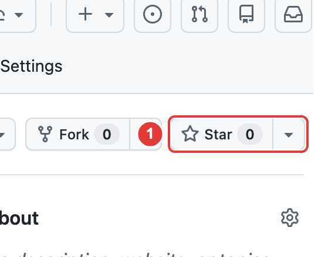

  

<h1 align="center">臺大玻片跑臺機</h1>

  

  <a href="README.md">繁體中文</a> · <a href="README.en.md">English</a>

## 1. Star the Project

This tool is currently in its beta testing stage. It is recommended to click **① Star** at the top right to bookmark the project so you can get notified about bug fixes, slide dataset updates, and the official release!

## 2. Download

Download this project: click **① Code → ② Download ZIP** (the image shows example button locations).

## 3. Find the ZIP

Open `chrome://downloads` in Chrome and click the **folder icon** beside the ZIP.

## 4. Extract

Mac: double-click `micro-main.zip`; Windows: right-click → **Extract All → Extract**.

## 5. Keep the folder

Move the extracted `micro-main` folder to a permanent location such as Documents, and keep it after installation.

## 6. Open Extensions

Enter `chrome://extensions` in Chrome's **address bar** and press Enter.

## 7. Enable Developer mode

Turn on **Developer mode** at the top right.

## 8. Load the extension

Click **Load unpacked**.

## 9. Select the folder

Choose **① extension** inside `micro-main`, then click **② Select / Select Folder**.

## 10. Installed

Installation is complete when **臺大玻片跑臺機** appears with its switch turned on.

## 11. Open the tool

Log in to the [NTU slide website](https://microteaching.ntu.edu.tw/), refresh the page, then click **the puzzle-piece icon → 臺大玻片跑臺機**.

## 12. Choose slides

Click **＋** beside a slide to add it; **✓** means it is already added.

## 13. Start practice

**① Enter the question count, then ② click「開始練習」(Start practice)**.

## 14. Answer

Fill in **① Organ and ② Diagnosis**, then click **③「提交答案」(Submit)**.

## 15. Check the answer

Check the answer, then click **「下一題」(Next)** or **「完成練習」(Finish)** on the last question.

## 16. View history

Open **「紀錄」(History)** to see your practice result.

