# micro｜臺大玻片跑臺機

[繁體中文](README.md) · [English](README.en.md)

## 1. 下載

下載這個專案：按 **① Code → ② Download ZIP**（圖為按鈕位置範例）。

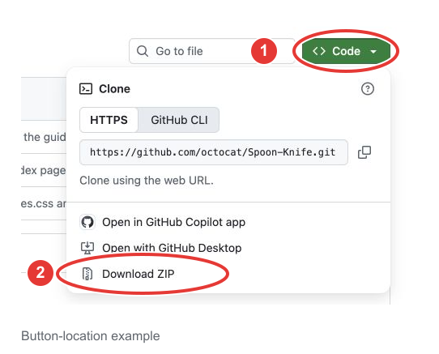

## 2. 找到 ZIP

在 Chrome 開啟 `chrome://downloads`，按 ZIP 旁的 **資料夾圖示**。

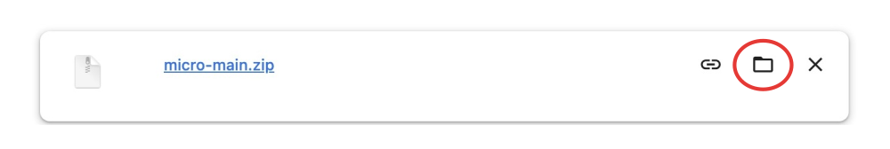

## 3. 解壓縮

Mac：連點兩下 `micro-main.zip`；Windows：右鍵 →「全部解壓縮」→「解壓縮」。

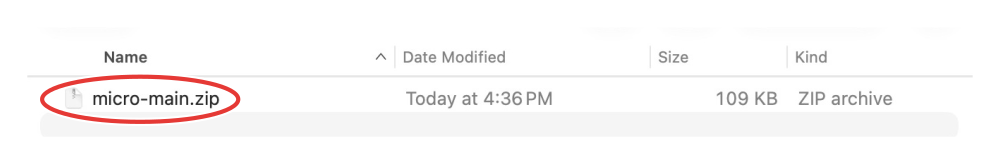

## 4. 保留資料夾

把解開的 `micro-main` 移到「文件」等固定位置，安裝後請保留。

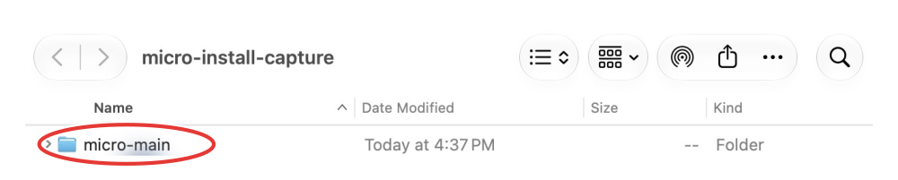

## 5. 開啟擴充功能頁面

在 Chrome **網址列** 輸入 `chrome://extensions`，按 Enter。

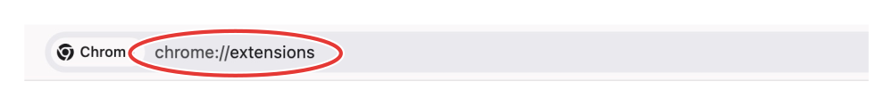

## 6. 開啟開發人員模式

打開右上角的 **Developer mode／開發人員模式**。

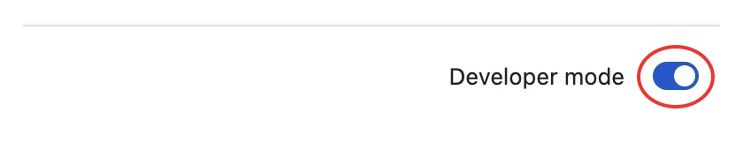

## 7. 載入 extension

按 **Load unpacked／載入未封裝項目**。

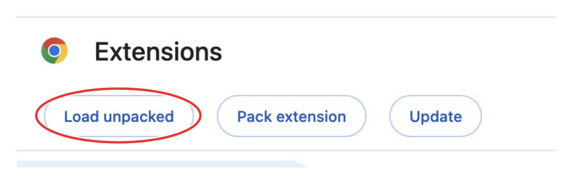

## 8. 選擇資料夾

選 `micro-main` 裡的 **① extension**，再按 **② Select／選取資料夾**。

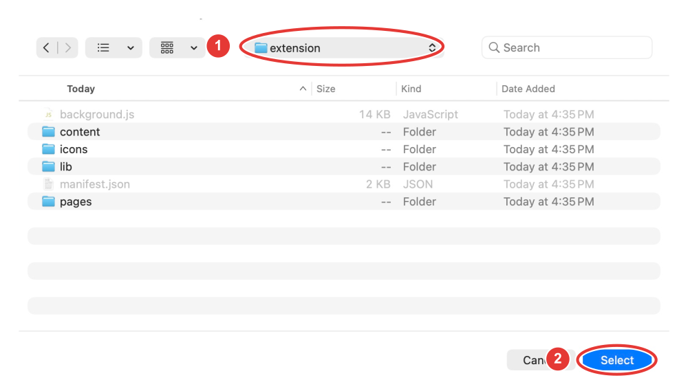

## 9. 安裝完成

看到「臺大玻片跑臺機」，而且開關已開啟，就是安裝完成。

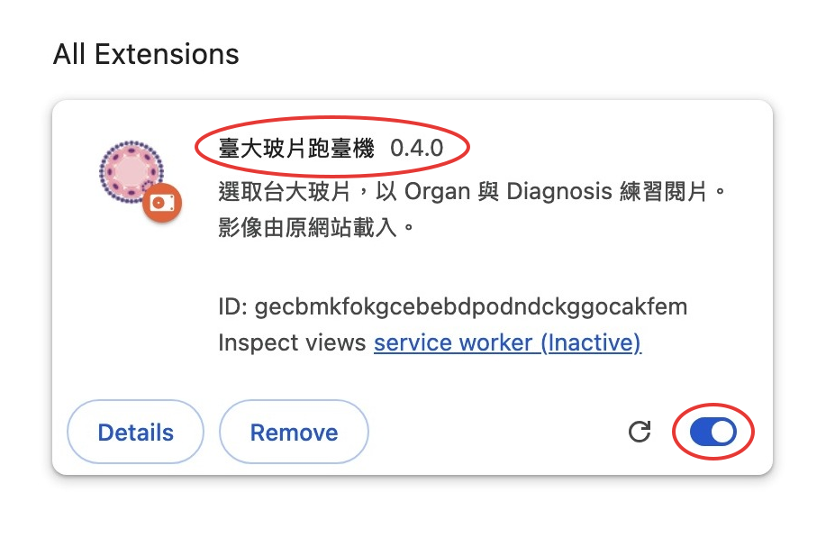

## 10. 開啟工具

登入[臺大玻片網站](https://microteaching.ntu.edu.tw/)並重新整理，再按 **拼圖圖示 → 臺大玻片跑臺機**。

## 11. 選題

點玻片旁的 **＋** 加入題目，**✓** 表示已加入。

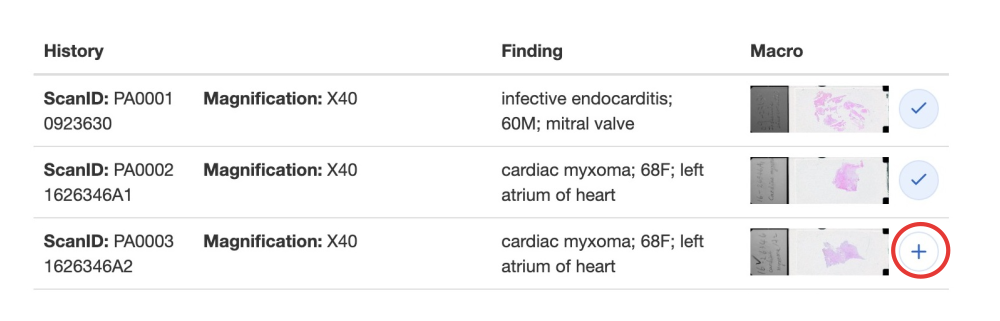

## 12. 開始練習

**① 輸入題數，② 按「開始練習」**。

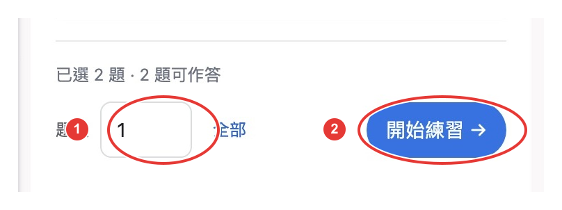

## 13. 作答

填 **① Organ（器官）、② Diagnosis（診斷）**，再按 **③「提交答案」**。

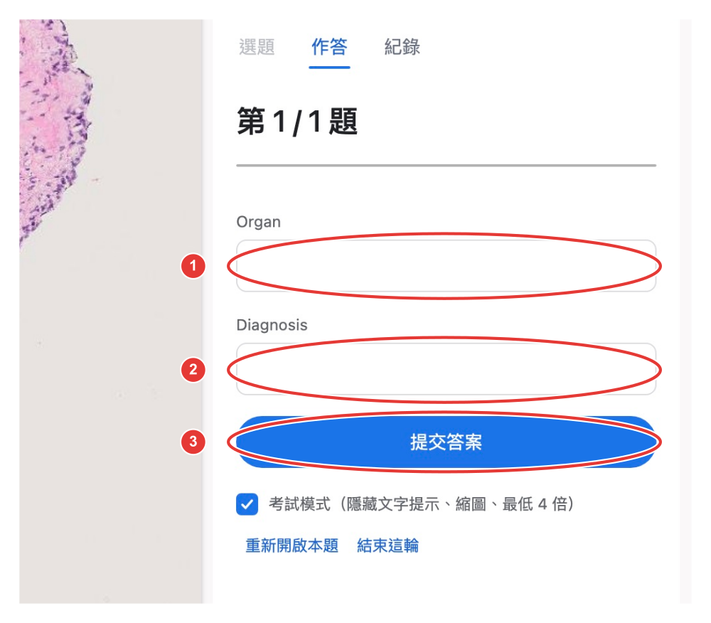

## 14. 核對答案

核對答案後，按「下一題」；最後一題按 **「完成練習」**。

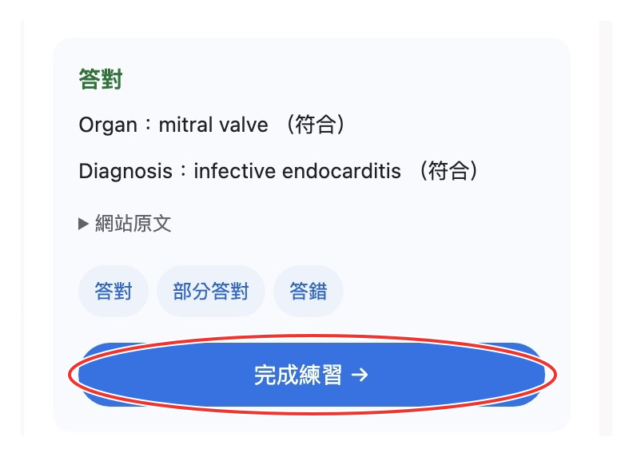

## 15. 查看紀錄

到 **「紀錄」** 查看這次練習結果。

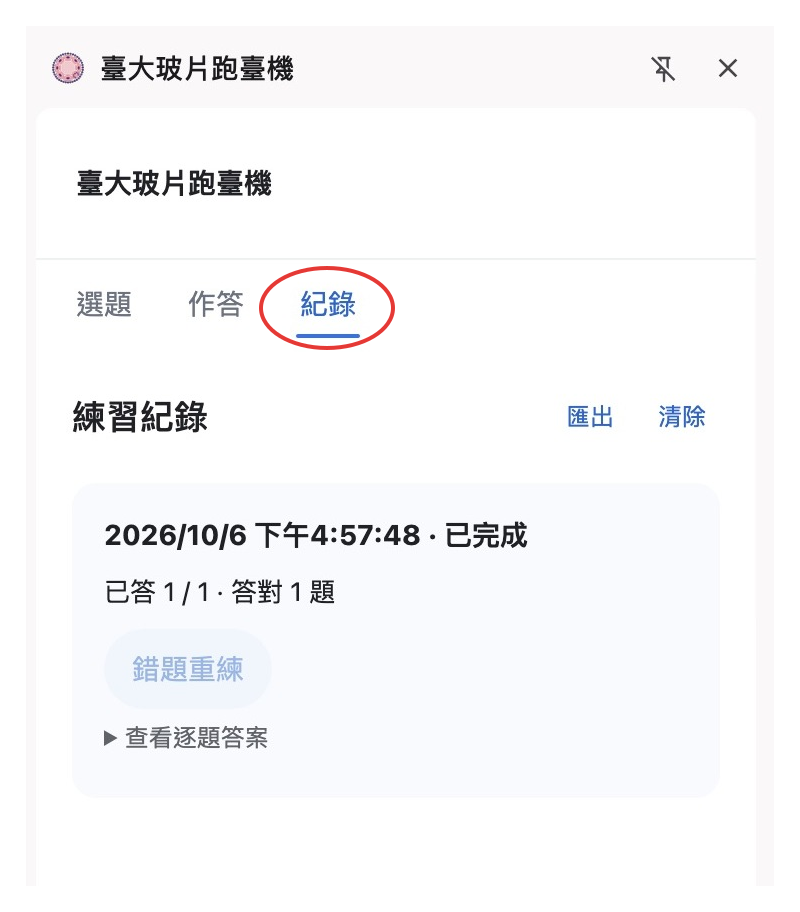
